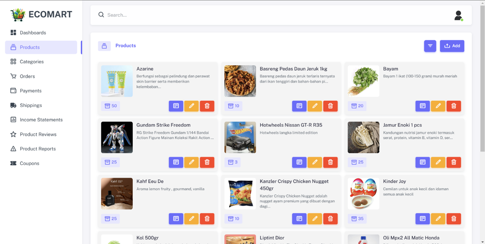
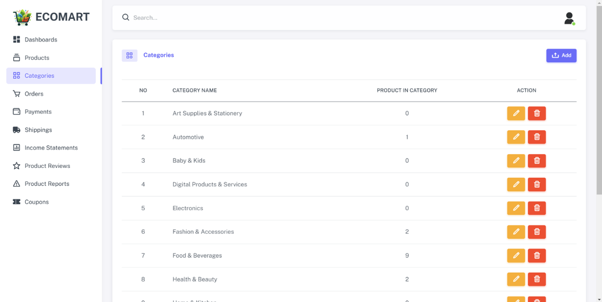
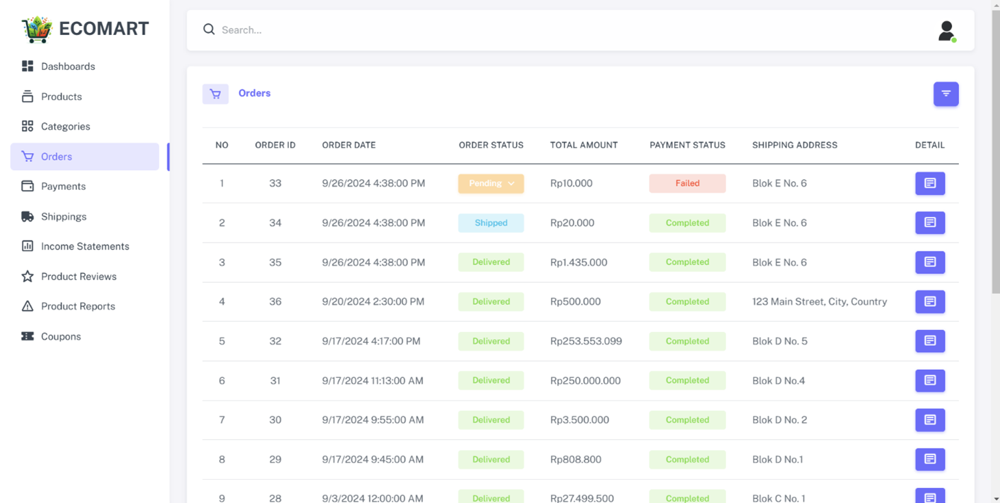
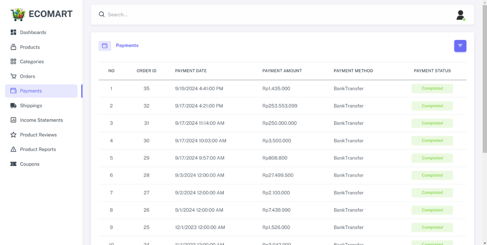
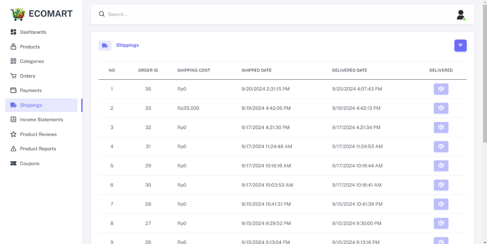
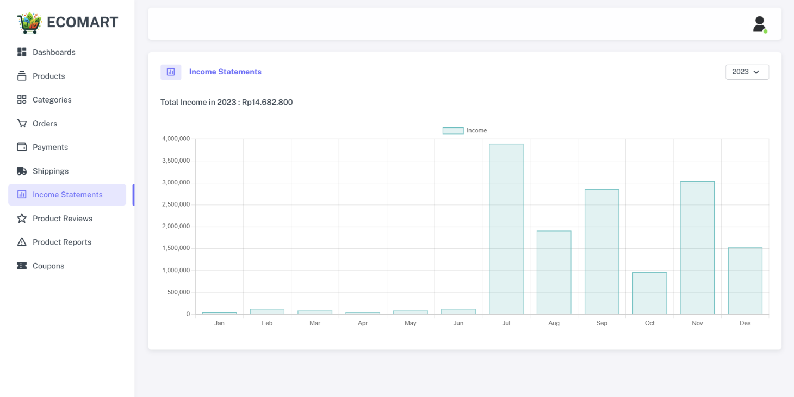
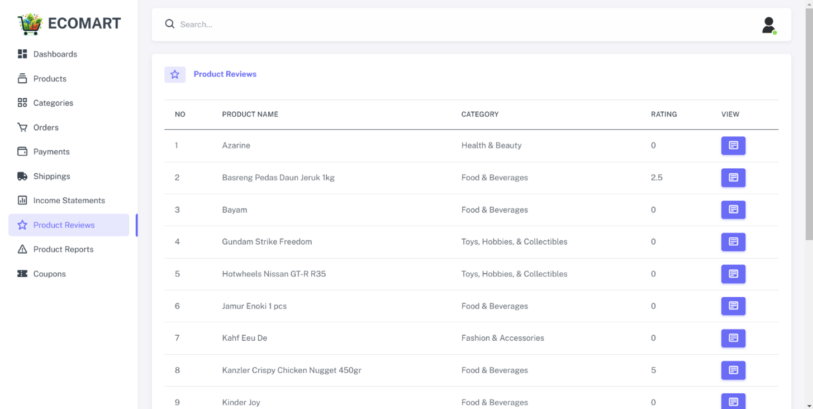
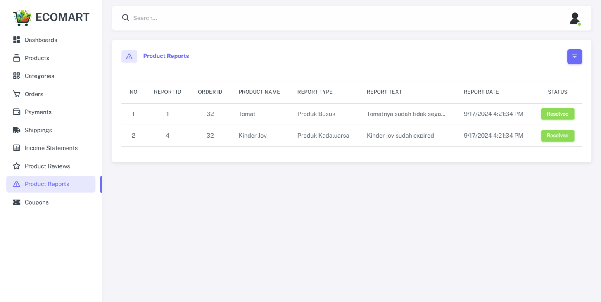
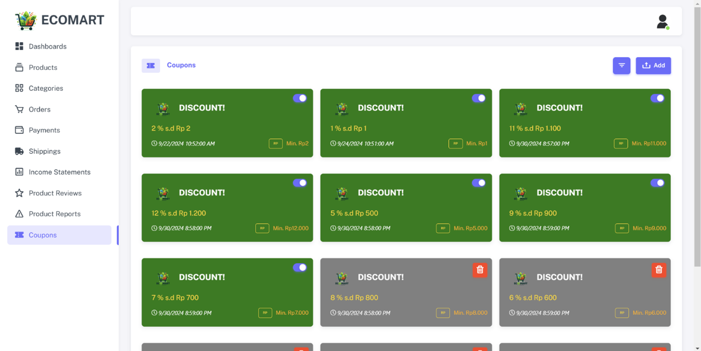

## EcoMart Admin

**EcoMart Admin** is a modern web-based dashboard for managing e-commerce operations — from products, orders, payments, users, to real-time analytics. Built for performance and ease of use, it empowers administrators to monitor and streamline store activities efficiently.

---

## 🚀 Features

- 🔐 Login – Secure access for authorized admins.
- 📊 Dashboard – Real-time analytics: sales, orders, top products.
- 📦 Products – Manage inventory, edit, delete, filter, and add new products.
- 🗂 Categories – Organize and manage product categories.
- 🛒 Orders – Track orders, status updates, and customer details.
- 💳 Payments – Monitor transaction status and payment methods.
- 🚚 Shipping – Track delivery status and shipment data.
- 📈 Income Statement – Visualize monthly/yearly revenue trends.
- ⭐ Product Reviews – Review feedback and product ratings.
- 📣 Reports – Handle user-submitted reports (e.g., damaged items).
- 🎟 Coupons – Create and manage time-limited discount codes.

---

## 🛠 Tech Stack

- Backend: ASP.NET Core MVC
- Frontend: Razor Views, Bootstrap 5
- Database: SQL Server
- ORM: Entity Framework Core
- Authentication: Identity Framework
- Media Management: Cloudinary API
- Charts: Chart.js
- Tools: Visual Studio 2022

---

## ⚙️ Getting Started

1. Go into directory where you plan on keeping project and run.

```bash
  git fork https://github.com/raffyhidayatulloh/EcoMart-Admin.git
```

2. Create a local SQL Server database.

3. Add connection string to app settings.json. It will look something like this:

```bash
  Data Source=.\\SQLEXPRESS;Initial Catalog=EcoMart;Integrated Security=True;Connect Timeout=30;Encrypt=True;Trust Server Certificate=True;Application Intent=ReadWrite;Multi Subnet Failover=False
```

4. Register for a Cloudinary Account and add Cloudname, ApiKey, and Api secret to appsettings.json.

---

## 📸 UI Preview

| Preview | Description |
|--------|-------------|
|  | **Login Page** |
|  | **Sales Overview** |
|  | **Product Management** |
|  | **Category List** |
|  | **Order Tracking** |
|  | **Payment Status** |
|  | **Delivery Info** |
|  | **Earnings Chart** |
|  | **User Feedback** |
|  | **User Reports** |
|  | **Promo Code Manager** |
